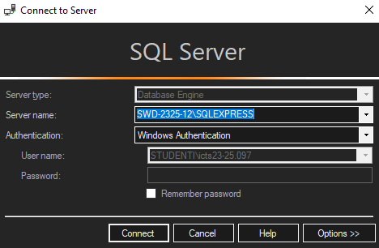
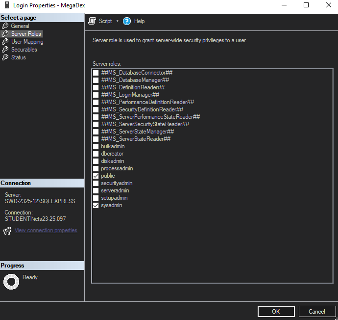
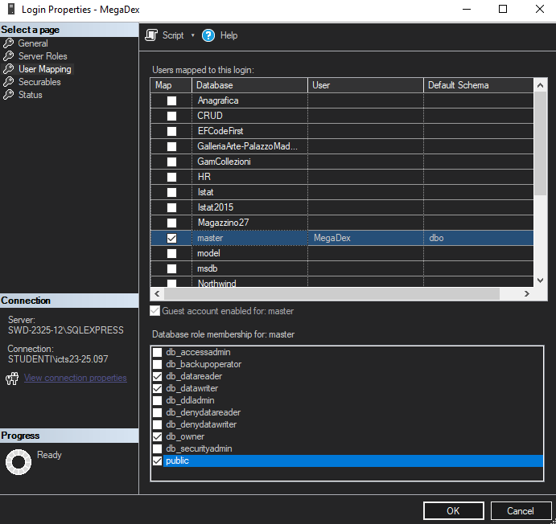
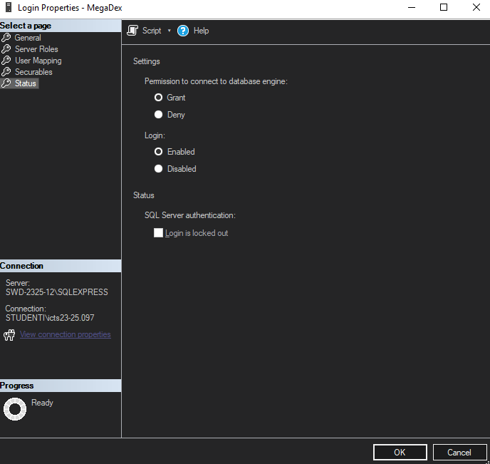
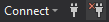
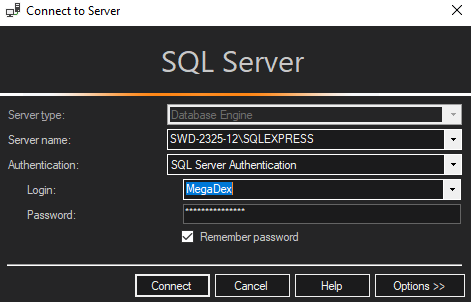
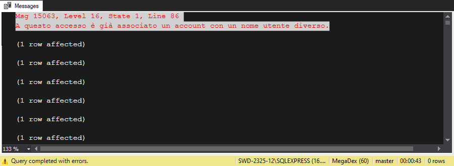
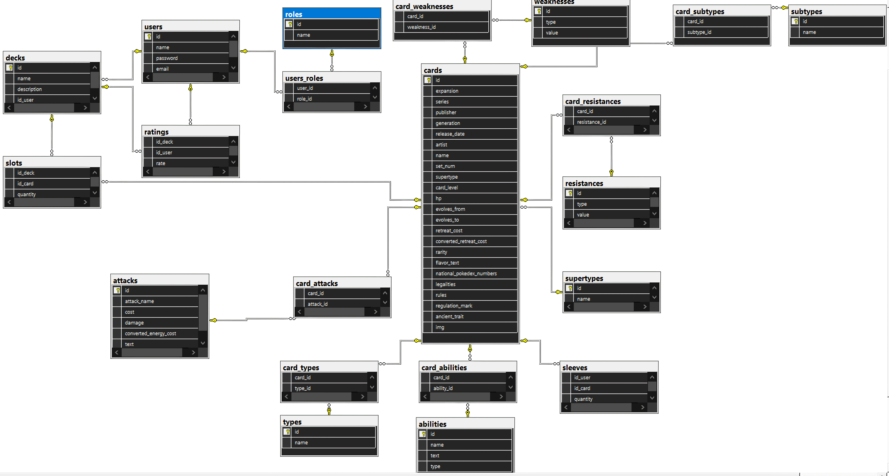

# Database

## Indice
- [Set-up passo-passo](#set-up-passo-passo)
- [Struttura Database](#struttura-database):
- [Tabelle](#tabelle)
  - [abilities](#abilities)
  - [attacks](#attacks)
  - [card_abilities](#card_abilities)
  - [card_attacks](#card_attacks)
  - [card_resistances](#card_resistances)
  - [card_subtypes](#card_subtypes)
  - [card_types](#card_types)
  - [card_weaknesses](#card_weaknesses)
  - [cards](#cards)
  - [decks](#decks)
  - [ratings](#ratings)
  - [resistances](#resistances)
  - [roles](#roles)
  - [sleeves](#sleeves)
  - [slots](#slots)
  - [subtypes](#subtypes)
  - [supertypes](#supertypes)
  - [types](#types)
  - [users](#users)
  - [users_roles](#users_roles)
  - [weaknesses](#weaknesses)

## Set-up passo-passo
<span style="color:red"> Disclaimer: </span> Sono stati usati SMSS 19 e SQL Server 2022 Express, non garantiamo il funzionamento con versioni precedenti o sucessive.

### Installazione Software
- Installare [SQL Server Management Studio 19](https://learn.microsoft.com/it-it/sql/ssms/release-notes-ssms?view=sql-server-ver16#193)
- Installare [SQL Server 2022 Express](https://www.microsoft.com/it-it/sql-server/sql-server-downloads) <br>
- Seguite l'installer e lasciate i valori di default del Wizard

### Configurazione SQL Server
- Avviate ```Gestione configurazione SQL Server 2022```
- Configurazione di rete SQL Server -> Protocolli per SQLEXPRESS -> verificate che ```Memoria condivisa```,```Named pipe``` e ```TCP/IP``` siano abilitate.<br>
Se non lo sono: click destro -> ```Abilita```<br>
- TCP/IP -> click destro -> proprietà -> Indirizzi IP -> Porta TCP = ```1433``` -> Applica
- Servizi di SQL Server -> SQL Server (SQLEXPRESS) -> ```Riavvia```
<br>
Una volta seguiti i passaggi SQL Server sarà configurato.

### Configurazione SQL Server Management Studio 19 (SMSS)
- Avviate ```SMSS```, dovrebbe esserci questa schermata, se non avete niente in Server Name, aprite il menù a tendina -> browse for more -> selezionate il server con il nome della vostra macchina (dovrebbe essere il solo server disponibile se non avete mai usato SQL) <br>


- Una volta connessi sull'object explorer(menù sulla sinistra): Security -> Login -> click destro -> New Login
- Selezionate SQL Server Autenthification. Usate come Username: ```MegaDex``` e Password: ```password1.``` e disabilitate ```Enforce password policy```.
- Server Roles -> ```public``` & ```sysadmin``` <br>

- User Mapping -> master -> ```db datawriter```,```db owner```, ```public``` <br>

- Status -> Selezionate ```Grant``` e ```Enabled``` <br>

- Premere OK
- In alto a sinistra disconnettiti <br>

- Riconnettiti con Authentication -> SQL Server Autethication -> User name: ```MegaDex```, Password: ```password1```. <br>

- In alto a sinistra premi ```New query``` e incolla il file ```Pokemon_db.sql``` dalla root del progetto
- Esegui la query e dopo circa 1 min dovresti avere un messaggio del genere<br>

- Controlla in ```Databases``` sulla barra a sinistra se è comparsa una voce ```pokemon_db```.
<br> <br>
# Struttura Database

Il database `pokemon_db` è progettato per gestire un sistema legato a carte collezionabili di Pokémon. Include informazioni su carte, attacchi, abilità, resistenze, debolezze e molto altro, e consente la gestione di mazzi di carte e utenti.<br>


## Tabelle

### abilities
Contiene le abilità speciali delle carte Pokémon.

- **PK**: `id`
- **id** (int): ID univoco dell'abilità.
- **name** (varchar 255): Nome dell'abilità.
- **text** (varchar 650): Descrizione dell'abilità.
- **type** (varchar 255): Tipo di abilità.

### attacks
Contiene le informazioni sugli attacchi delle carte Pokémon.

- **PK**: `id`
- **id** (int): ID univoco dell'attacco.
- **attack_name** (varchar 255): Nome dell'attacco.
- **cost** (varchar 255): Costo dell'attacco in termini di energia.
- **damage** (varchar 255): Danno inflitto dall'attacco.
- **converted_energy_cost** (int): Costo energetico convertito.
- **text** (nvarchar MAX): Descrizione dell'attacco.

### card_abilities
Mappa tra le carte e le loro abilità.

- **PK**: (`card_id`, `ability_id`)
- **FK**: `card_id` fa riferimento a `cards(id)`, `ability_id` fa riferimento a `abilities(id)`
- **card_id** (nvarchar 50): ID della carta.
- **ability_id** (int): ID dell'abilità (riferimento alla tabella `abilities`).

### card_attacks
Mappa tra le carte e i loro attacchi.

- **PK**: (`card_id`, `attack_id`)
- **FK**: `card_id` fa riferimento a `cards(id)`, `attack_id` fa riferimento a `attacks(id)`
- **card_id** (nvarchar 50): ID della carta.
- **attack_id** (int): ID dell'attacco (riferimento alla tabella `attacks`).

### card_resistances
Mappa tra le carte e le loro resistenze.

- **PK**: (`card_id`, `resistance_id`)
- **FK**: `card_id` fa riferimento a `cards(id)`, `resistance_id` fa riferimento a `resistances(id)`
- **card_id** (nvarchar 50): ID della carta.
- **resistance_id** (int): ID della resistenza (riferimento alla tabella `resistances`).

### card_subtypes
Mappa tra le carte e i loro sottotipi.

- **PK**: (`card_id`, `subtype_id`)
- **FK**: `card_id` fa riferimento a `cards(id)`, `subtype_id` fa riferimento a `subtypes(id)`
- **card_id** (nvarchar 50): ID della carta.
- **subtype_id** (int): ID del sottotipo (riferimento alla tabella `subtypes`).

### card_types
Mappa tra le carte e i loro tipi.

- **PK**: (`card_id`, `type_id`)
- **FK**: `card_id` fa riferimento a `cards(id)`, `type_id` fa riferimento a `types(id)`
- **card_id** (nvarchar 50): ID della carta.
- **type_id** (int): ID del tipo (riferimento alla tabella `types`).

### card_weaknesses
Mappa tra le carte e le loro debolezze.

- **PK**: (`card_id`, `weakness_id`)
- **FK**: `card_id` fa riferimento a `cards(id)`, `weakness_id` fa riferimento a `weaknesses(id)`
- **card_id** (nvarchar 50): ID della carta.
- **weakness_id** (int): ID della debolezza (riferimento alla tabella `weaknesses`).

### cards
Contiene le informazioni dettagliate su ogni carta Pokémon.

- **PK**: `id`
- **id** (nvarchar 50): ID univoco della carta.
- **expansion** (varchar 255): Nome dell'espansione.
- **series** (varchar 255): Nome della serie.
- **publisher** (varchar 255): Editore della carta.
- **generation** (varchar 255): Generazione a cui appartiene la carta.
- **release_date** (varchar 255): Data di rilascio della carta.
- **artist** (varchar 255): Artista che ha disegnato la carta.
- **name** (varchar 255): Nome della carta.
- **set_num** (varchar 255): Numero della carta all'interno del set.
- **supertype** (int): Super tipo della carta (riferimento a `supertypes`).
- **card_level** (varchar 255): Livello della carta.
- **hp** (varchar 255): Punti vita della carta.
- **evolves_from** (varchar 255): Da quale carta si evolve.
- **evolves_to** (varchar 255): In quale carta si evolve.
- **retreat_cost** (varchar 255): Costo di ritirata.
- **converted_retreat_cost** (varchar 255): Costo di ritirata convertito.
- **rarity** (varchar 255): Rarità della carta.
- **flavor_text** (varchar 255): Testo di sapore.
- **national_pokedex_numbers** (varchar 255): Numeri del Pokédex nazionale.
- **legalities** (varchar 255): Legalità della carta nei tornei.
- **rules** (nvarchar MAX): Regole specifiche della carta.
- **regulation_mark** (varchar 255): Marchio di regolamentazione.
- **ancient_trait** (varchar 255): Tratto antico.
- **img** (varchar 255): URL dell'immagine della carta.

### decks
Contiene le informazioni sui mazzi creati dagli utenti.

- **PK**: `id`
- **FK**: `id_user` fa riferimento a `users(id)`
- **id** (int): ID univoco del mazzo.
- **name** (nvarchar 50): Nome del mazzo.
- **description** (nvarchar MAX): Descrizione del mazzo.
- **id_user** (int): ID dell'utente che ha creato il mazzo (riferimento a `users`).

### ratings
Contiene le valutazioni assegnate dagli utenti ai mazzi.

- **PK**: (`id_deck`, `id_user`)
- **FK**: `id_deck` fa riferimento a `decks(id)`, `id_user` fa riferimento a `users(id)`
- **id_deck** (int): ID del mazzo.
- **id_user** (int): ID dell'utente.
- **rate** (bit): Valutazione (1 o 0).

### resistances
Contiene le informazioni sulle resistenze delle carte.

- **PK**: `id`
- **id** (int): ID univoco della resistenza.
- **type** (varchar 255): Tipo di resistenza.
- **value** (varchar 255): Valore della resistenza.

### roles
Contiene i ruoli assegnabili agli utenti.

- **PK**: `id`
- **id** (int): ID univoco del ruolo.
- **name** (varchar 255): Nome del ruolo.

### sleeves
Contiene le informazioni sulle "sleeves" (custodie) delle carte possedute dagli utenti.

- **PK**: (`id_user`, `id_card`)
- **FK**: `id_user` fa riferimento a `users(id)`, `id_card` fa riferimento a `cards(id)`
- **id_user** (int): ID dell'utente.
- **id_card** (nvarchar 50): ID della carta.
- **quantity** (int): Quantità della carta.

### slots
Contiene le informazioni sugli slot del mazzo (carte incluse nel mazzo).

- **PK**: (`id_deck`, `id_card`)
- **FK**: `id_deck` fa riferimento a `decks(id)`, `id_card` fa riferimento a `cards(id)`
- **id_deck** (int): ID del mazzo.
- **id_card** (nvarchar 50): ID della carta.
- **quantity** (nchar 10): Quantità della carta nello slot.

### subtypes
Contiene i sottotipi delle carte Pokémon.

- **PK**: `id`
- **id** (int): ID univoco del sottotipo.
- **name** (varchar 255): Nome del sottotipo.

### supertypes
Contiene i super tipi delle carte Pokémon.

- **PK**: `id`
- **id** (int): ID del super tipo.
- **name** (varchar 255): Nome del super tipo.

### types
Contiene i tipi delle carte Pokémon.

- **PK**: `id`
- **id** (int): ID univoco del tipo.
- **name** (varchar 255): Nome del tipo.

### users
Contiene le informazioni sugli utenti registrati.

- **PK**: `id`
- **id** (int): ID univoco dell'utente.
- **name** (varchar 255): Nome dell'utente.
- **password** (varchar 255): Password dell'utente.
- **email** (varchar 255): Email dell'utente.

### users_roles
Associa i ruoli agli utenti.

- **PK**: (`user_id`, `role_id`)
- **FK**: `user_id` fa riferimento a `users(id)`, `role_id` fa riferimento a `roles(id)`
- **user_id** (int): ID dell'utente (riferimento a `users`).
- **role_id** (int): ID del ruolo (riferimento a `roles`).

### weaknesses
Contiene le informazioni sulle debolezze delle carte.

- **PK**: `id`
- **id** (int): ID univoco della debolezza.
- **type** (varchar 255): Tipo di debolezza.
- **value** (varchar 255): Valore della debolezza.

---